Automatische kettingspanner voor de Batavus Relaxx
==================================================

Sinds een tijdje in Bemmel gewoond te hebben, ben ik in het bezit van een Batavus Relaxx: een fiets die het midden houdt tussen een ligfiets en een stadsfiets. Na een kleine tien kilometer over de dijk naar Nijmegen, voelde het lederen zadel op mijn oude Gazelle zo hard aan als steen. Hoewel de Relaxx niet aan kop zal gaan in een snelheidsrace, is hij—de naam zegt het al—wel een hele comfortabele fiets, en hij maakte het woon-werkverkeer dan ook een stuk aangenamer. Ook sinds verhuizing naar Utrecht weet hij zich in het goed staande te houden in het stadsverkeer.

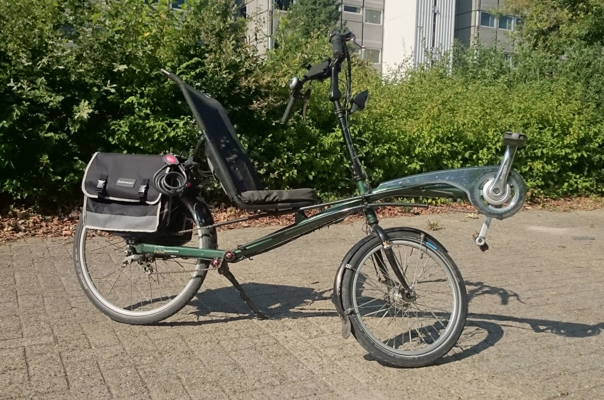

   *De FlevoBike/Batavus Relaxx, groene uitvoering, met modificaties. Oorspronkelijk uitgebracht tussen 1995 en 1999*

De Relaxx heeft één groot nadeel, iets wat eigenlijk niets minder dan een ontwerpfout is. De kettingweg is, begrijpelijkerwijs, erg lang: van de trappers aan de voorkant tot de naaf in het achterwiel. Om deze lange ketting in goede banen te leiden, gebruikt de Relaxx twee plasic kokers, waar de ketting doorheen loopt, en twee plastic wieltjes, die de ketting om het frame heenleiden. De achtervork is relatief breed ten opzichte van de rest van het frame, en zou anders in de weg zitten van de ketting. De wieltjes leiden de ketting hier omheen.

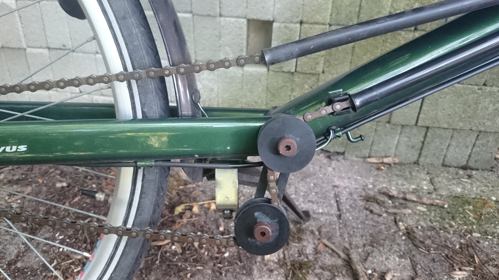

   *De oude situatie: plastic wieltjes*

De wieltjes regelen de kettingspanning, aangezien het onderste wieltje op een metalen arm zit, en dit geheel (de arm en het wieltje) kan draaien. Om de ketting op spanning te brengen, moet je de bout door het bovenste wieltje losdraaien, met je hele gewicht het onderste wieltje naar voren duwen, en dan tegelijkertijd de bout weer aandraaien.

Na verloop van tijd komt er dan onvermijdelijk toch weer wat speling in de afstemming, en begint het cranktandwiel tandjes over te slaan als je eens wat harder doortrapt. Door het gebrek aan een veer is er niets om de kettingspanning op peil te houden. Bovendien zijn de wieltjes niet gelagerd, en steekt het geheel nogal uit, met het risico dat er bijvoorbeeld een ernaast geparkeerde fiets tegenaan komt.

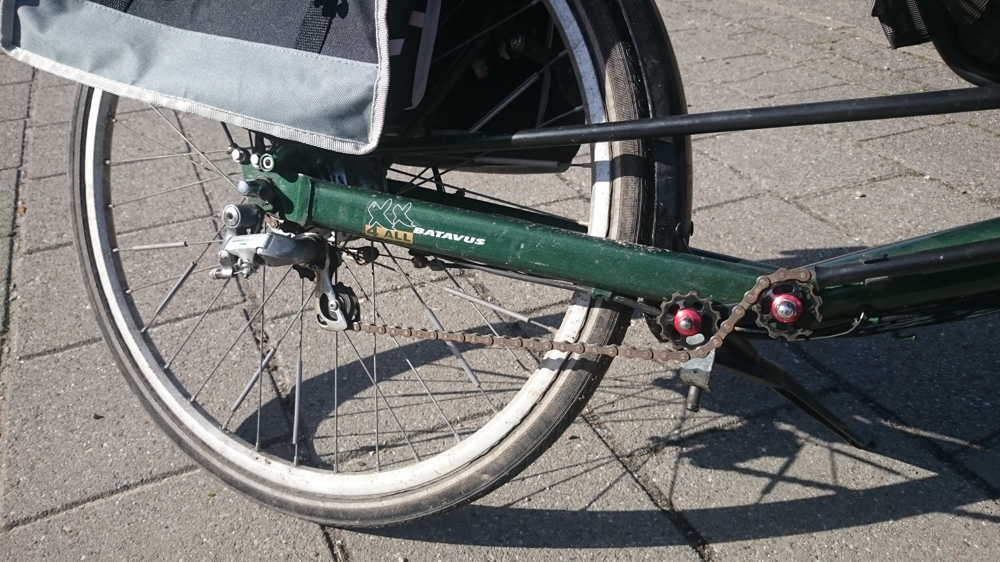

   *De nieuwe situatie: derailleur geïnstalleerd, en twee nieuwe geleidewieltjes*

Om een en ander te verbeteren, heb ik een simpele maar effectieve automatische kettingspanner gemaakt, met behulp van een oude derailleur, twee losse derailleurwieltjes, en wat kleine ijzerwaar uit de doe-het-zelfwinkel.

Tappen van het derailleuroog
----------------------------

De Relaxx is uitgerust met een derailleuroog, maar hier zit standaard geen schroefdraad in. Om een derailleur te kunnen installeren, moet er eerst schroefdraad ingetapt worden. Dit kun je laten doen bij de fietsenmaker, maar toen het goedkoper bleek om zelf een tap te kopen was de beslissing snel gemaakt. Let wel op dat je de juiste tap gebruikt: het is een M10 tap, maar met een andere spoed dan gebruikelijk; zoek naar een "M10 x 1 mm" tap. Ik heb er één kunnen bestellen bij `Giga-Bikes <https://www.giga-bikes.nl>`_ in Tilburg voor €7,35.

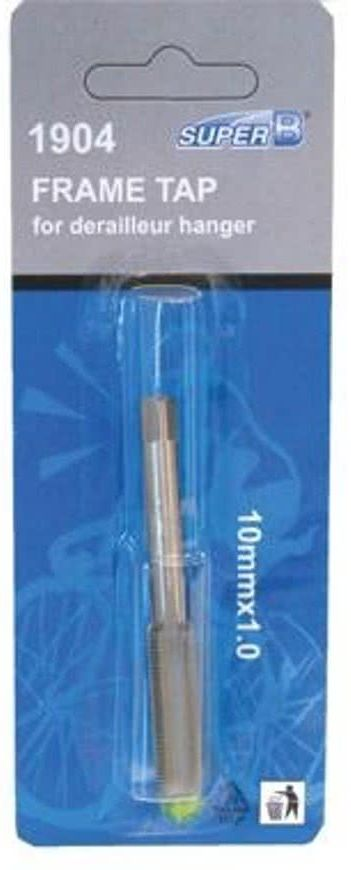

   *M10 x 1 mm tap voor het derailleuroog*

Om het te tappen kun je het beste een accuboor gebruiken, en deze op de boorstand zetten. Je wilt zo langzaam mogelijk draaien, en de tap hierbij heel stabiel houden. Vooral dat laatste is veel makkelijker als je een accuboor gebruikt dan het met de hand te doen. Draai de tap er niet in één keer in maar draai hem tussendoor ook een paar keer weer een paar slagen terug, om het metaal weg te voeren.

Inbouwen van de derailleur
--------------------------

Bij `AL16 Wheelers <https://www.facebook.com/AL16Wheelers/>`_ mocht ik een tweedehands derailleur meenemen voor €6,38, inclusief de bijbehorende twee wieltjes. Omdat ik liever niet de lengte van de ketting aan wilde passen, zocht ik naar de kleinst mogelijke derailleur. Deze Shimano 600 past perfect, maar let op dat hij wel te klein is voor kogelgelagerde wieltjes.

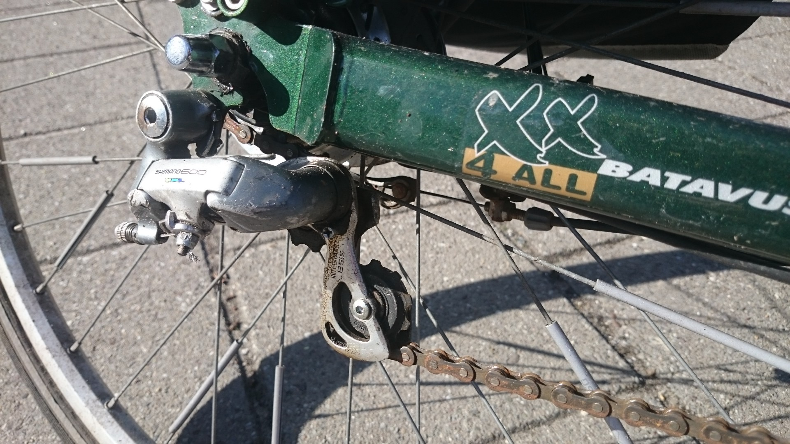

   *Derailleur*

De derailleur verschuift normaal zijwaarts (van en naar het frame toe) om de ketting op het juiste tandwiel te leggen. De positie wordt bepaald door de versnellingskabel die naar het stuur toeloopt. Deze functie is nu niet nodig, aangezien de derailleur alleen wordt gebruikt omwille van zijn torsieveer. Om hem op de juiste stand vast te zetten, heb ik een los versnellingskabeltje gekocht (ook bij AL16 Wheelers, voor €0,50), de derailleur met de hand opgespannen totdat de positie van de ketting er goed uitzag, en vervolgens de kabel vastgezet met een schroefje op de derailleur dat wel voor deze functie gemaakt leek.

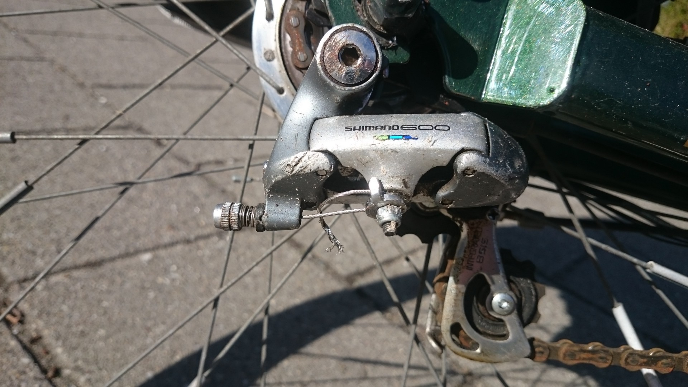

   *De derailleur, vastgezet met een eindje versnellingskabel*

Montage van de nieuwe geleidewieltjes
-------------------------------------

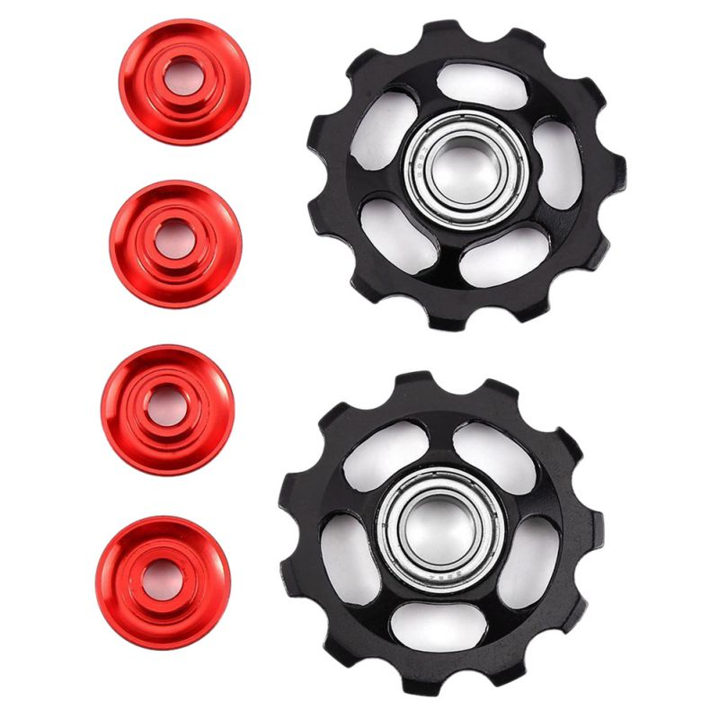

De oude plastic geleidewieltjes waren niet gelagerd, wat voor veel wrijving zorgde als ze niet regelmatig gesmeerd worden, en zeker wanneer er wat vuil rond de as sluipt. Ik heb de oude wieltjes vervangen door kogelgelagerde, 11 tands aluminium wieltjes. Deze zijn normaal eigenlijk bedoeld voor plaatsing in een derailleur, maar ze zijn ook ideaal voor deze toepassing.

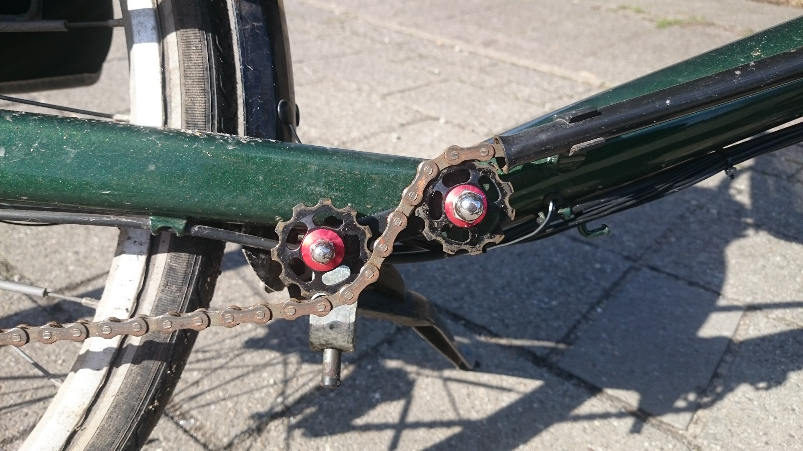

   *Zijaanzicht van de nieuwe geleidewieltjes: de as in het rechterwieltje is M8, die in het linker M6*

Oorspronkelijk zat het eerste wieltje (rechtsboven in de foto) middels een M8 bout in het frame geschroefd. Ik heb deze vervangen door een stuk M8 draaideind, op de juiste lengte afgezaagd met een ijzerzaagje. De rode busjes in het wieltje moeten even uitgeboord worden op 8 mm. Een dopmoer zorgt ervoor dat er aan de buitenkant geen scherpe eindjes meer aanzitten.

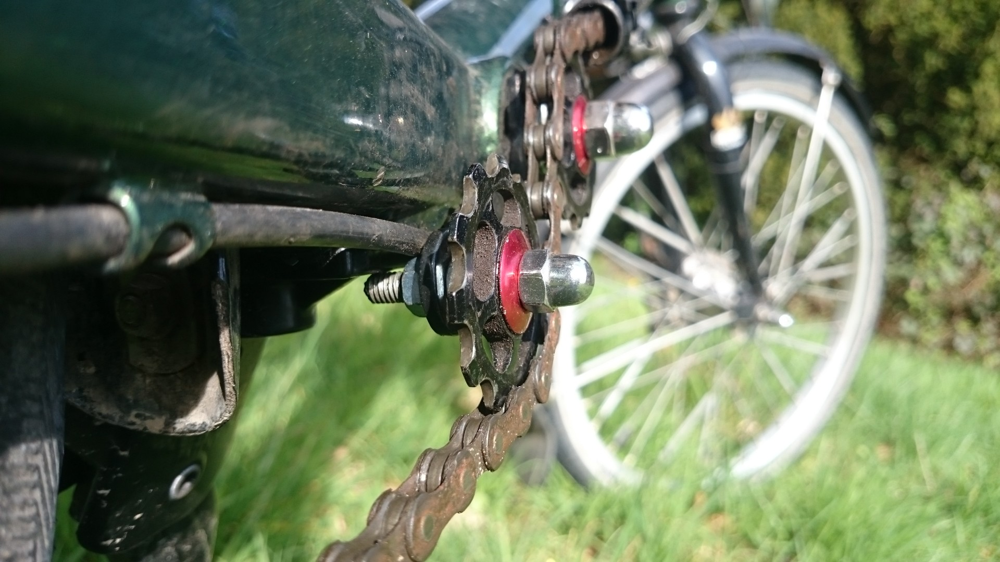

   *Het M6 draaideind steekt een stukje uit aan de achterkant, en rust hiermee tegen de onderzijde van het frame*

Voor het tweede wieltje heb ik een M6 draaideind genomen, en deze zo gemonteerd dat het aan de achterkant ongeveer een centimeter extra uitsteekt. Daardoor rust het tegen de onderkant van het frame, of mogelijk tegen de montagebeugel van de fietsstandaard, afhankelijk van het model standaard dat geïnstalleerd is. Het krachtmoment dat onstaat als gevolg van de kettingspanning draagt er (in tegenstelling tot voorheen) nu juist aan bij om het geheel op zijn plaats te houden. Dit levert een stabiele plaatsing op.

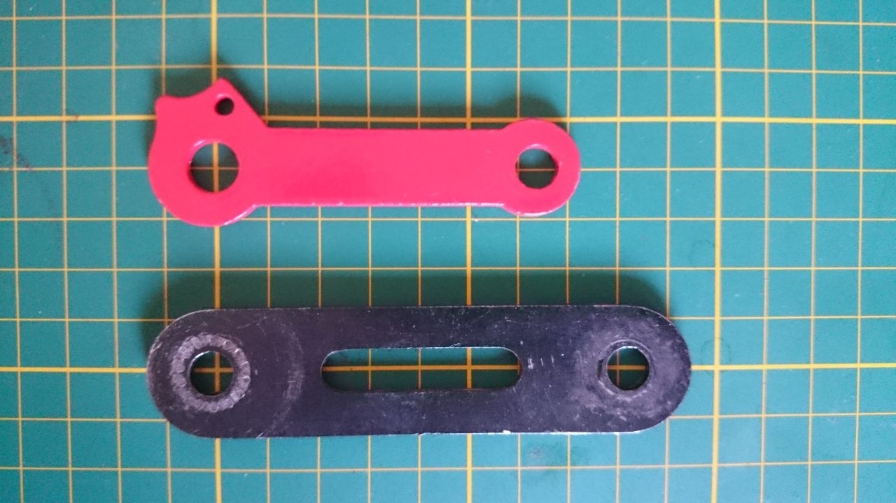

   *Beugeltjes voor de montage van het linker wieltje: origineel (onder) en nieuw (boven)*

Het beugeltje waar het linker wieltje op gemonteerd zit, is niet het origineel wat bij de fiets hoort, maar een iets kortere die toevallig in de werkplaats lag. De afstand tussen de middelpunten van de wieltjes is bij deze zo'n 6.3 cm (tegenover 8 cm bij het orignele beugeltje); de breedte is ca. 2 cm. Je zou hier ook een vlak aluminiumprofiel voor kunnen gebruiken. Het originele beugeltje is ook een optie, maar is aanzienlijk langer en heeft hierdoor een extra stelschroef in het midden nodig. Het onderste wieltje steekt in deze opstelling wederom een flink stuk onder het frame uit, dus een kortere beugel is aan te raden.

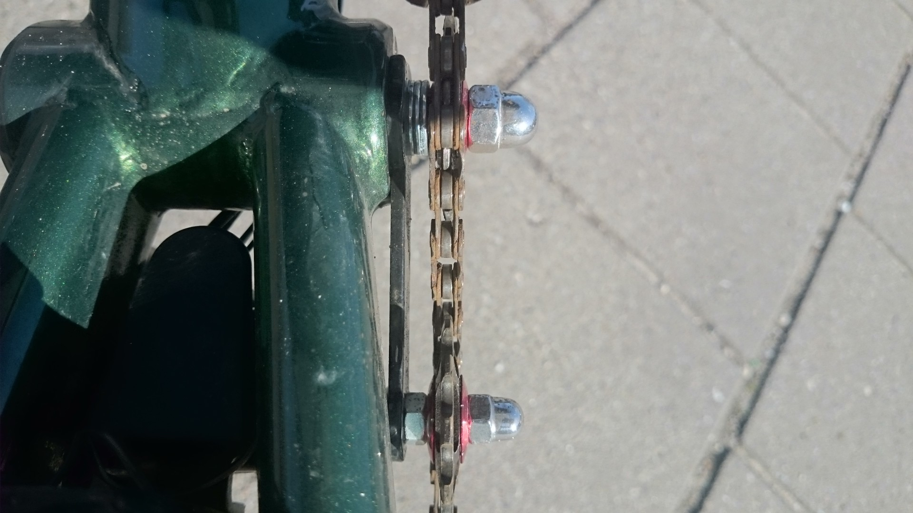

In het bovenaanzicht kun je de uitlijning van de kettingbaan goed zien. Het bleek dat een paar sluitringen boven en een moertje onder de perfecte uitlijning opleverden, maar afhankelijk van je onderdelen moet je er misschien even mee experimenteren. Je kunt de zijwaartse positie van de wieltjes goed afstellen door er wat extra sluitringetjes tussen te doen of weg te nemen.

Conclusie
---------

Na ruim twee weken intensief testen, is de crank niet één keer overgeslagen. Vers gesmeerd draaien de trappers gemakkelijk terugwaarts; het leeuwendeel van de wrijving komt nu voor rekening van de twee lange plastic kokers waar de ketting doorheen voert. In combinatie met het grotere cranktandwiel (38T in plaats van 33T) dat ik hiervoor reeds heb geplaatst, ben ik dik tevreden!

Ik ben altijd benieuwd naar feedback, andere oplossingen, of variaties op het idee. Stuur me een mail op: charl@itfromb.it

Totale kosten
-------------

+--------------------------------+------------------------------------------------------------------------------+-------------------+
| Wat                            | Waar                                                                         | Kosten            |
+================================+==============================================================================+===================+
| Tap                            | `Giga-bikes.nl (Tilburg) <http://www.giga-bikes.nl/>`_                       | €7,35             |
+--------------------------------+------------------------------------------------------------------------------+-------------------+
| Derailleur + versnellingskabel | `AL16 Wheelers (Utrecht) <https://www.facebook.com/AL16Wheelers/>`_          | €6,88             |
+--------------------------------+------------------------------------------------------------------------------+-------------------+
| Derailleurwieltjes             | `AliExpress <https://www.aliexpress.com>`_                                   | €4,55             |
+--------------------------------+------------------------------------------------------------------------------+-------------------+
| Beugeltje (aluminium profiel)  | Bouwmarkt                                                                    | ±€2,50            |
+--------------------------------+------------------------------------------------------------------------------+-------------------+
| IJzerwaren:                    |                                                                              | ±€3,00            |
|                                |                                                                              |                   |
| - Draaideind M6                |                                                                              |                   |
| - Draaideind M8                |                                                                              |                   |
| - Moer M6 (2x)                 |                                                                              |                   |
| - Dopmoer M6                   |                                                                              |                   |
| - Dopmoer M8                   |                                                                              |                   |
| - Sluitring M6                 |                                                                              |                   |
| - Sluitring M8 (3x)            |                                                                              |                   |
|                                |                                                                              |                   |
+--------------------------------+------------------------------------------------------------------------------+-------------------+
|                                                                                                   **Totaal:** | €24,28            |
+--------------------------------+------------------------------------------------------------------------------+-------------------+

